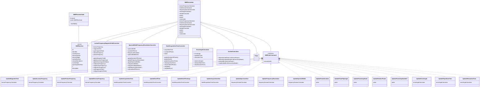

```mermaid

classDiagram

class NMRNucleus {
    <<struct>>
    id
    identifier
    nameNucleus
    atomicNumber
    atomicWeight
    symbolNucleus
    naturalAbundance
    nuclearSpin
    gyromagneticRatio
    γ
    description
}

class NMRPeriodicTable {
    $ shared
    nuclei: [NMRNucleus]
    - readTable()
}

NMRPeriodicTable o-- NMRNucleus

class NMRCalculator {
    - larmorFrequencyCalculator
    - timeDomainCalculator
    - frequencyDomainCalculator
    - ernstAngleCalculator
    - decibelCalculator
    - pulse1
    - pulse2
    - commands
}

NMRCalculator --> "1" NMRNucleus

class NMRCalculator {
    - larmorFrequencyCalculator
    - timeDomainCalculator
    - frequencyDomainCalculator
    - ernstAngleCalculator
    - decibelCalculator
    - pulse1
    - pulse2
    - commands
}

class LarmorFrequencyMagneticFieldConverter {
    + larmorFrequency
    + magneticField
    + gyromagneticRatio
    + electroFrequency
    + protonFrequency
    - updateMagneticField()
    - updateLarmorFrequency()
    - updateGyromagneticRatio()
    + set(larmorFrequency:)
    + set(electronFrequency:)
    + set(protonFrequency:)
    + set(magneticField:)
    + set(gyromagneticRatio:)
}

NMRCalculator -- LarmorFrequencyMagneticFieldConverter

class SpectralWidthFrequencyResolutionConverter {
    + spectralWidth
    + numberOfPoints
    + frequencyResolution
    + spectralWidthInkHz
    - updateNumberOfPoints()
    - updateFrequencyResolution()
    - updateSpectralWidth()
    + set(spectralWidth:)
    + set(spectralWidthInkHz:)
    + set(frequencyResolution:)
    + set(numberOfPoints:)
}

NMRCalculator -- SpectralWidthFrequencyResolutionConverter

class DwellAcquisitionTimeConverter {
    + acqusitionTime
    + numberOfPoints
    + dwell
    - updateNumberOfPoints()
    - updateDwell()
    - updateAcquisitionTime()
    + set(acqusitionTime:)
    + set(numberOfPoints:)
    + set(dwell:)
    + set(dwellInμs:)
}

NMRCalculator -- DwellAcquisitionTimeConverter

class ErnstAngleCalculator {
    + ernstAngle
    + repetitionTime
    + relaxationTime
    + set(ernstAngle:)
    + set(repetitionTime:)
    + set(relaxationTime:)
}

NMRCalculator -- ErnstAngleCalculator

class DecibelCalculator {
    + db(measuredPower:referencePower:)
    + db(measuredAmplitude:referenceAmplitude:)
    + power(dB:referencePower:)
    + amplitude(dB:referenceAmplitude:)
}

NMRCalculator -- DecibelCalculator

NMRCalculator "1" -- "2" Pulse

class NMRCalcCommand {
    <<interface>>
    execute(with:)
}

NMRCalculator o-- NMRCalcCommand

class UpdateMagneticField {
    larmorFrequencyCalculator
}
class UpdateLarmorFrequency {
    larmorFrequencyCalculator
}
class UpdateProtonFrequency {
    larmorFrequencyCalculator
}
class UpdateElectronFrequency {
    larmorFrequencyCalculator
}

NMRCalcCommand <|.. UpdateMagneticField
NMRCalcCommand <|.. UpdateLarmorFrequency
NMRCalcCommand <|.. UpdateProtonFrequency
NMRCalcCommand <|.. UpdateElectronFrequency

class UpdateAcquisitionTime {
    dwellAcquisitionTimeConverter
}
class UpdateDwellTime {
    dwellAcquisitionTimeConverter
}
class UpdateDwellTimeInμs {
    dwellAcquisitionTimeConverter
}
class UpdateAcquisitionSize {
    dwellAcquisitionTimeConverter
}

NMRCalcCommand <|.. UpdateAcquisitionTime
NMRCalcCommand <|.. UpdateDwellTime
NMRCalcCommand <|.. UpdateDwellTimeInμs
NMRCalcCommand <|.. UpdateAcquisitionSize

class UpdateSpectrumSize {
    frequencyDomainCalculator
}
class UpdateFrequencyResolution {
    frequencyDomainCalculator
}
class UpdateSpectralWidth {
    frequencyDomainCalculator
}

NMRCalcCommand <|.. UpdateSpectrumSize
NMRCalcCommand <|.. UpdateFrequencyResolution
NMRCalcCommand <|.. UpdateSpectralWidth

class UpdatePulseDuration {
    pulse
}
class UpdatePulseFlipAngle {
    pulse
}
class UpdatePulseAmplitude {
    pulse
}
class UpdateRelativePower {
    pulse
}
class UpdatePulseAmplitudeInT {
    pulse
}

NMRCalcCommand <|.. UpdatePulseDuration
NMRCalcCommand <|.. UpdatePulseFlipAngle
NMRCalcCommand <|.. UpdatePulseAmplitude
NMRCalcCommand <|.. UpdateRelativePower
NMRCalcCommand <|.. UpdatePulseAmplitudeInT

class UpdateErnstAngle {
    ernstAngleCalculator
}
class UpdateRepetitionTime {
    ernstAngleCalculator
}
class UpdateRelaxationTime {
    ernstAngleCalculator
}


NMRCalcCommand <|.. UpdateErnstAngle
NMRCalcCommand <|.. UpdateRepetitionTime
NMRCalcCommand <|.. UpdateRelaxationTime

```

