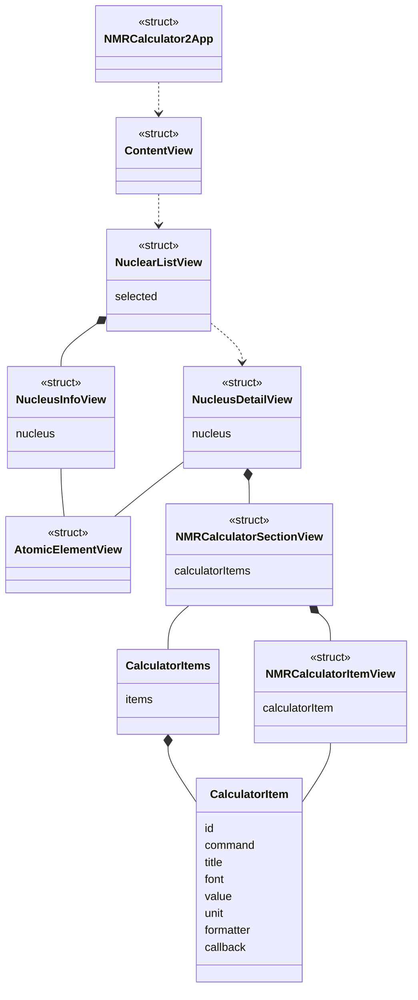

```mermaid
classDiagram

class NMRCalculator2App {
    <<struct>>
}

class ContentView {
    <<struct>>
}

class NuclearListView {
    <<struct>>
    selected
}

class NucleusInfoView {
    <<struct>>
    nucleus
}

class NucleusDetailView {
    <<struct>>
    nucleus
}

class AtomicElementView {
    <<struct>>
}

class NMRCalculatorSectionView {
    <<struct>>
    calculatorItems
}

class NMRCalculatorItemView {
    <<struct>>
    calculatorItem
}

class CalculatorItem {
    id
    command
    title
    font
    value
    unit
    formatter
    callback
}

class CalculatorItems {
    items
}

NMRCalculator2App ..> ContentView
ContentView ..> NuclearListView

NuclearListView *-- NucleusInfoView
NuclearListView ..> NucleusDetailView

NucleusInfoView -- AtomicElementView

NucleusDetailView -- AtomicElementView
NucleusDetailView *-- NMRCalculatorSectionView

NMRCalculatorSectionView *-- NMRCalculatorItemView
NMRCalculatorSectionView -- CalculatorItems

CalculatorItems *-- CalculatorItem

NMRCalculatorItemView -- CalculatorItem


```

