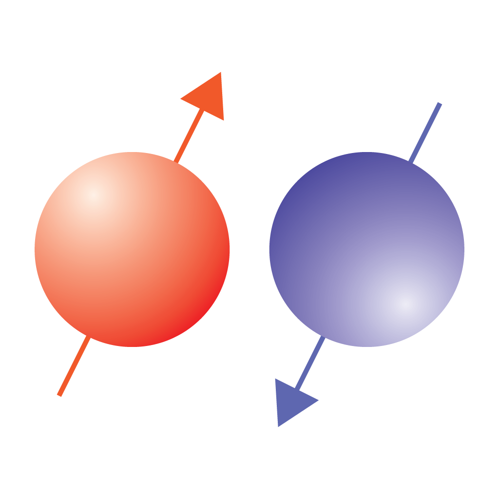

# NMR Calculator 2

<!--

-->

You may clone or download the source from the GitHub [repository](https://github.com/jaeseung16/NMRCalculator).

[Send us an email.](mailto:jaeseung@gmail.com?subject=RE:%20NMR%20Calculator%20Inquiry)

## Description

The app shows the list of the isotopes with non-zero nuclear spin angular momentum. Select an isotope and calculate some basic parameters used in nuclear magnetic resonance (NMR) spectroscopy.

For each isotope, the app displays the information relevant to NMR spectrosopy and the sections to calculate some basic parameters

### Information section
For a chosen isotope, this section displays the atomic symbol with the mass number, the nuclear spin angular momentum, the gyromagnetic ratio, and the natural abundance.

### Calculator section
A user can update one of the parameters in each subsection to recalculate the others.

- Larmor frequencies
  - The subsection displays the external field and the corresponding Larmor frequencies for the chosen isotope, the proton, and the free electron. 

- Time domain
  - The subsection displays the parameters used for signal acquisition, such as the number of data points, acquisition duration, and dwell time.

- Frequency domain
  - The subsection displays the paramters describing a NMR specturm, such as the number of data points, spectral width, and frequency resolution.

- Pulse 1
  - Ths subsection displays the parameters for a RF pulse, such as the pulse duration, flip angle, and RF amplitude in Hz and μT.

- Pulse 2
  - The subsection displays the parameters for another RF pulse, such as the pulse duration, flip angle, RF amplitude in Hz, and the RF power relative to Pulse 1.

- Ernst angle
The subsection displays the parameters related to the Ernst angle, such as the Ernst angle and repetition time for a given relaxation time.

#### History
- **2.0** Sep, 2023

- **1.3.2** Feb 10, 2020
  - Added WatchOS extension.
    - Search for an isotope with non-zero nuclear spin on your wrist!
    - Select an isotope and find out its Larmor frequency for a given external magnetic field or proton Armor frequency by using the Digital Crown.

- **1.3.1** Dec 2, 2019
  - Supports the dark mode in iOS 13

- **1.3** Apr 1, 2019
  - The selected nucleus is remembered and will appear in the next launch
  - The values entered in the 'Singal', 'RF Pulse', and 'Solution' scenes are remembered and will appear in the next launch

- **1.2** Nov 1, 2017
  - Corrected the names of some nuclei
  - Made consistent the vertical positions of the tabs

- **1.1** Sep 28, 2016
  - Nucleus
    - Added the Larmor frequency of a free electron in GHz.
    - Added the "Search Web" button to allow search the selected isotope on the web.
  - Signal
    - One of the items can be deactivated by tabbing the corresponding label. While deactivated, the value will not be changed.
  - Pulse
    - Added a new section to calculate the Ernst angle.
    - One of the items, except "RF power relative to 1st (dB)", can be deactivated by tabbing the corresponding label. While deactivated, the value will not be changed.
  - Info
    - Added the link to the source of the electron gyromagnetic ratio: http://physics.nist.gov/cgi-bin/cuu/Value?gammae
    - Added the formula for the Ernst angle.

- **1.0** Aug 24, 2016
